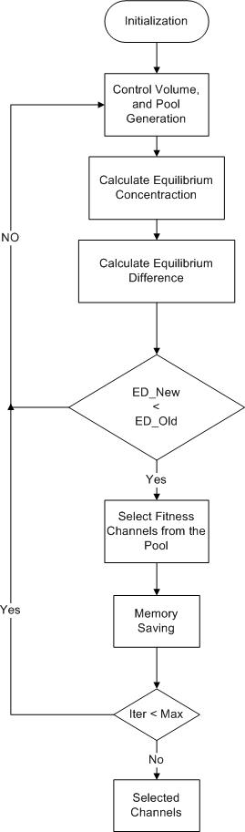
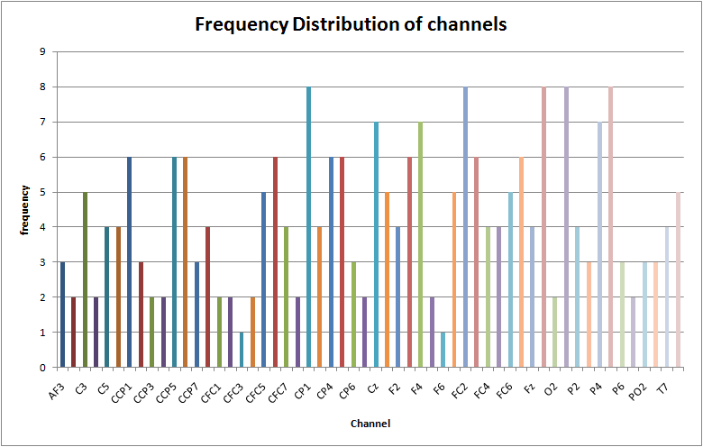
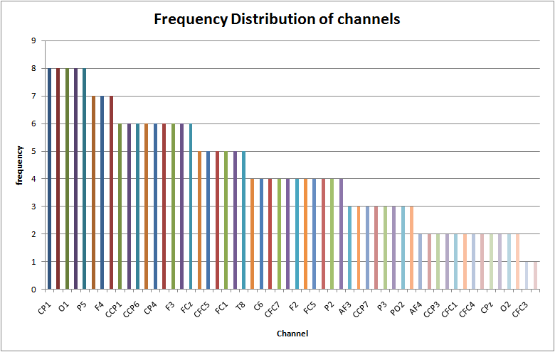

# EEG Channel Selection using Equilibrium Optimizer
Optimal Channel selection of EEG using Equilibrium Optimizer and Frequency Distribution

Fisher and Correlation are used as the fitness function for EEG channel selection. BCI VIa dataset is used for subjects a,b,f and g. c and d sujects are ommitted because of their synthetic nature. 

# Flowchart EEG Channel Selection Equilibrium Optimizer

#  Selected Channels using Frequency Distribution

